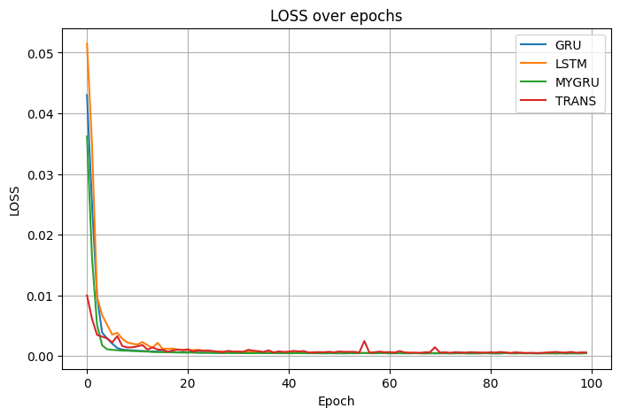
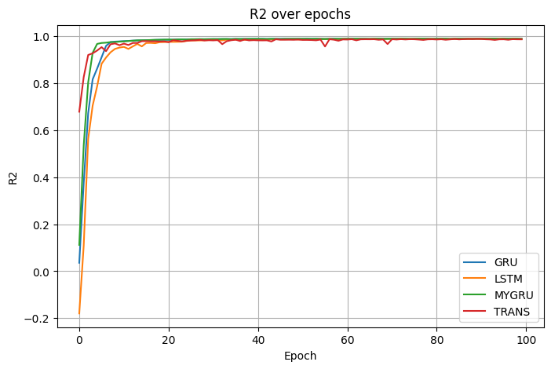
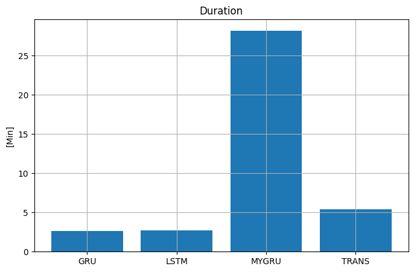

# XBIOM-2

## Neuronové sítě pro časové řady

Vývoj architektur pro modelování časových řad dobře ukazuje postupné překonávání limitů předchozích přístupů. Klasické RNN byly prvními sítěmi určenými pro sekvenční data, ale kvůli problému s vanishing/exploding gradientem nedokázaly efektivně zachytit dlouhodobé závislosti. To vedlo k zavedení LSTM, které díky paměťovým buňkám a řídicím branám dokáží udržovat informace po delší dobu. GRU pak zjednodušily architekturu LSTM, čímž snížily počet parametrů a výpočetní náročnost, přičemž si zachovaly srovnatelný výkon.

Paralelně se začaly využívat 1D konvoluční sítě (CNN), které jsou velmi rychlé a dobře identifikují lokální vzory, ale jejich schopnost pracovat s dlouhodobými vztahy je omezená. Proto se často používají hybridní modely CNN+LSTM, které kombinují rychlou extrakci lokálních vzorů s pamětí LSTM.

Nejnovějším trendem jsou Transformery, založené na mechanismech self-attention. Ty dokážou efektivně zachytit vztahy napříč celou sekvencí a lépe pracují s dlouhými časovými řadami než LSTM/GRU. Na druhou stranu jsou výpočetně náročnější a vyžadují více trénovacích dat.

**Přehled vlastností jednotlivých sítí**

| Model                                     | Princip                                                                               | Výhody                                                                 | Nevýhody                                                                              | Typické použití                                                  |
| ----------------------------------------- | ------------------------------------------------------------------------------------- | ---------------------------------------------------------------------- | ------------------------------------------------------------------------------------- | ---------------------------------------------------------------- |
| **RNN** (Recurrent Neural Networks)       | Zpracovává sekvenci postupně, skrytý stav přenáší informaci z minulých kroků          | Jednoduché, rychlé na malé sekvence, základní model pro sekvenční data | Problémy s **exploding/vanishing gradientem**, špatně zachytává dlouhodobé závislosti | Jednoduché predikce časových řad, jazykové modely                |
| **LSTM** (Long Short-Term Memory)         | Zavádí *paměťové buňky* a brány (input, forget, output) pro udržení dlouhodobé paměti | Dobře zvládá dlouhé závislosti, široce používaný standard              | Náročnější výpočetně, více parametrů                                                  | Predikce časových řad, NLP, řeč, bio signály                     |
| **GRU** (Gated Recurrent Unit)            | Zjednodušená verze LSTM (update/reset gate), méně parametrů                           | Rychlejší trénování než LSTM, podobná přesnost, menší paměťová stopa   | O něco slabší na velmi dlouhé závislosti                                              | Predikce časových řad, kde je důležitá rychlost a menší model    |
| **1D CNN** (Konvoluční sítě pro sekvence) | Extrahuje lokální vzory pomocí konvolucí přes časové kroky                            | Velmi rychlé, dobře zachytává lokální struktury, paralelizovatelné     | Neumí přímo modelovat dlouhodobé závislosti                                           | Analýza signálů, klasifikace krátkých sekvencí                   |
| **CNN + LSTM** (hybrid)                   | CNN vytáhne lokální vzory, LSTM zachytí dlouhodobé vztahy                             | Kombinuje výhody obou, robustní pro složitá data                       | Ještě složitější architektura, delší trénink                                          | Predikce s více měřítky (např. počasí, zdravotní signály)        |
| **Transformery** (Attention mechanismy)   | Self-attention váží důležitost každého časového kroku vůči všem ostatním              | Skvěle zachytávají dlouhodobé závislosti, paralelizace, škálovatelnost | Vysoce náročné na data a výpočet, složitější implementace                             | Moderní SOTA pro NLP, predikce časových řad s dlouhým horizontem |

Obecně platí, že:

    LSTM je osvědčený standard pro většinu aplikací.

    GRU je vhodnější tam, kde je potřeba rychlejší trénink a menší model.

    Transformery jsou nejlepší volbou pro velmi dlouhé časové řady a složité závislosti, ale jejich použití má smysl především u větších datasetů.

## Výběr pro zpracování
### Vlastní GRU
jako taková naivní implementace, pro vyzkoušení.

### GRU
 pro porovnání s naivní implementací

### LSTM
 protože je to taková klasika

### Transformer
 jako nejmodernější

## Metriky
- Přesnost: $MSE$, $R^2$
- Rychlost, resp doba běhu

## Dataset
Máme k dispozici soubor dat z reálné teplárny umístěné ve středně velkém městě v Evropě. Teplárna ohřívá vodu a distribuuje teplo po celém městě. Naším cílem je předpovědět teplotu vratné vody na základě aktuálních a historických nastavení výkonu teplárny, výstupní teploty vody a venkovních teplot naměřených na různých místech ve městě.

Celková velikost datasetu je 13829 záznamů před pročištěním. Dataset ale vykazuje mezery v datech a tím je nesouvislý, např. zjevné chybné hodnoty ze senzorů. Proto je nutné rozdělit ho na sekvence a trénovat po sekvencích, aby nedocházalo ke zkreslení. Postup je takový, že se provede normalizace, u teplot jsem ještě před tím provedl převod do °F. Potom je každá sekvence rozdělena na tréovací a validční část.

## Postup
Pro provední porovnání jsem napsal trénovací smyčku, která se vypořádává s nutností zpracování batche po segmentech a s tím spojenými problémy, jako je vyhodncení některých metrik.
Při běhu jsou logovány všechny metriky a na závěr vyhodnoceny v grafech.

## Vyhodnocení
Ztrátová funkce byla použita MSELoss.

Z grafů je vidět, že rozdíly mezi modely jsou minimální. Dokonce i "naivní" vlastní GRU je velice konkurenceschopná, co se výsledku predikce týká.

Nicméně doba běhu je mnohonásobně delší. To přičítám optimalizovanému modelu Torchu.
